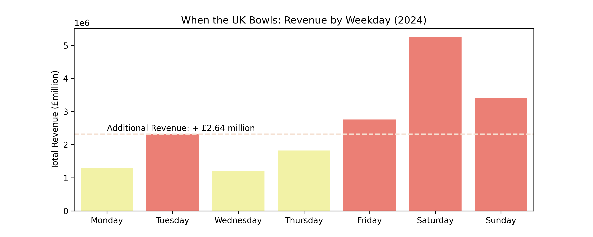
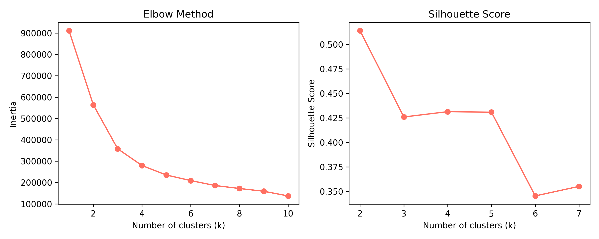
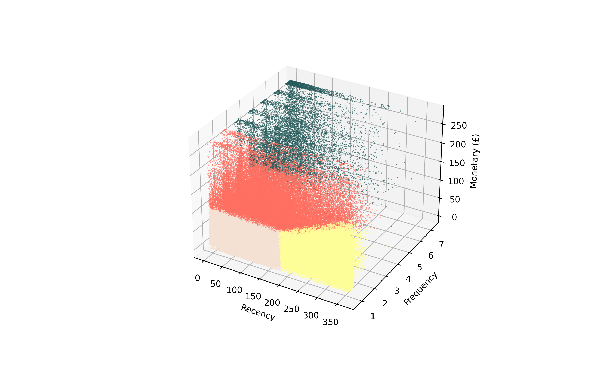
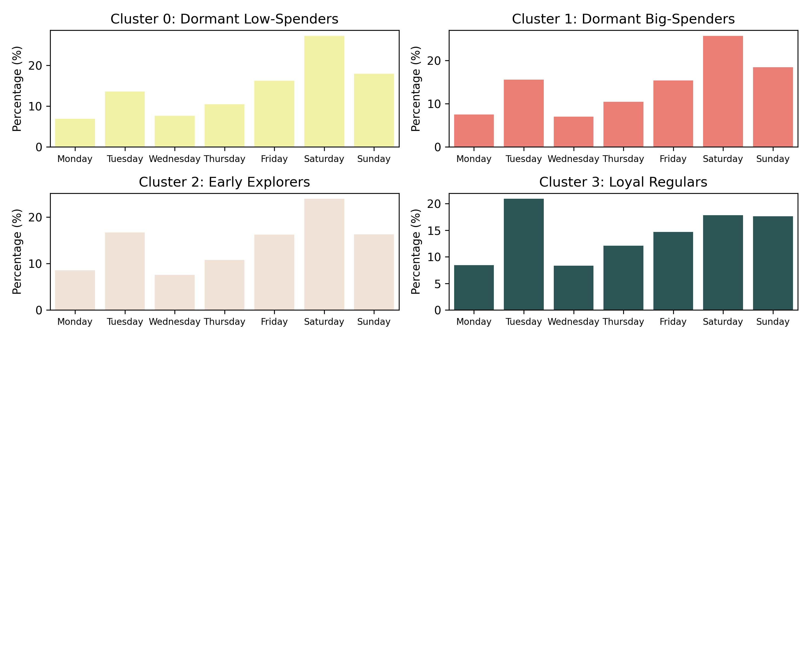

# 🎯 Customer Segmentation using RFM analysis  

**Libraries:** `scikit-learn`, `matplotlib`, `seaborn`, `plotly.express`, `geopandas`  
**Dataset:** proprietary, annoymised customer-level booking data    

This project explores customer segmentation for the fictional hospitality brand XYZ Entertainment Center, aiming to identify customers most likely to respond to targeted promotions that encourage weekday bookings.    

## 🧠 Analytical Approach
 - **RFM feature engineering** to quantify customer behaviour
 - **K-Means clustering** to segment customers by value and engagement
 - **Visual analytics** to interpret booking patterns and segment characteristics
 - **Campaign strategy design** focused on high-potential, weekday-receptive segments    

## ✨ Results
 - Identified **4** meaningful customer segments
 - Selected **2** clusters for campaign targeting, covering **56.6%** of the customer base
 - Developed a segmentation-informed campaign recommendation framework for weekday growth    

📖 Jupyter Notebook: [GitHub](https://github.com/dpb24/customer-segmentation/blob/main/notebooks/Customer_Segmentation_for_XYZ_Entertainment.ipynb) | [CoLab](https://colab.research.google.com/drive/1riolBlBa0T5GyXE4dJXOTh7B0Bq_p01L)  

     
    
    
    

